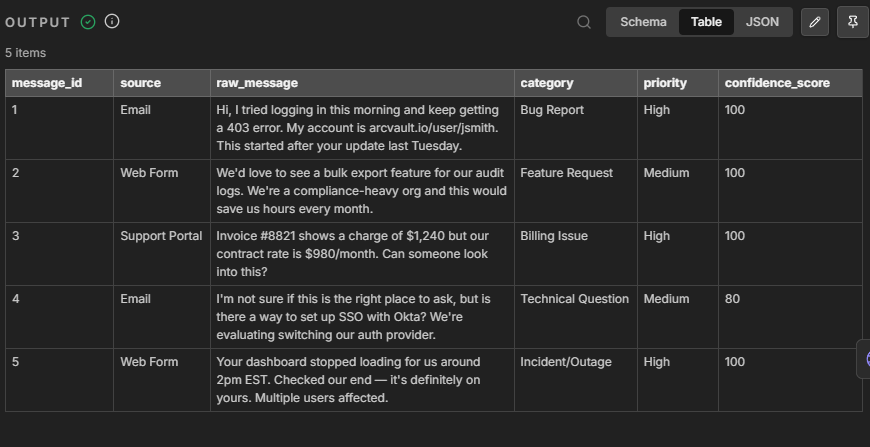
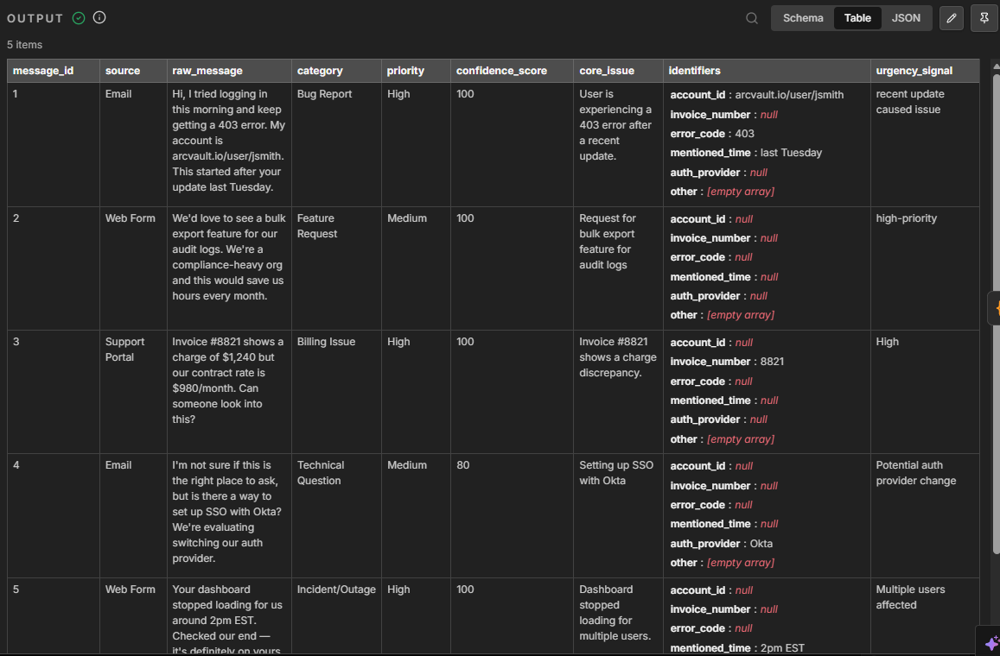
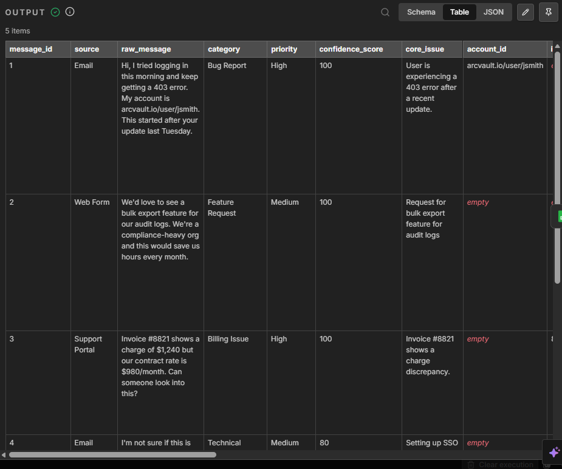

# AI Email Intake & Triage Automation

An AI-powered email intake and triage workflow built with **n8n**.

The workflow automatically processes incoming emails, classifies requests using AI, enriches the extracted information, determines the appropriate routing and escalation path, generates a structured summary, and stores the final result in Google Sheets.

## Workflow Overview


## How It Works

### 1. Gmail Trigger

The workflow starts automatically when a new email is received.


### 2. AI Classification

The incoming request is analyzed using an AI model to identify its type and relevant characteristics. The classification result is then parsed into a structured format for further processing.



### 3. AI Enrichment

The classified request is enriched with additional structured information to provide more context for downstream decision-making.



### 4. Routing & Escalation

The workflow evaluates the classified and enriched request to determine the appropriate routing and escalation path.


### 5. Final Output

The processed information is transformed into a structured final output that can be stored and used for further processing.



## Workflow Architecture

```text
Gmail Trigger
      ↓
Email Processing
      ↓
AI Classification
      ↓
Classification Parsing
      ↓
AI Enrichment
      ↓
Enrichment Parsing
      ↓
Routing & Escalation
      ↓
Final Output Generation
      ↓
Google Sheets
```

## Key Features

* Automated email intake
* AI-powered request classification
* Structured information extraction
* AI-based request enrichment
* Conditional routing
* Escalation logic
* Structured final output
* Automated data storage
* End-to-end workflow orchestration

## Technologies

* **n8n** — workflow automation and orchestration
* **Gmail** — email trigger and data source
* **AI / LLM** — classification and enrichment
* **Google Sheets** — structured data storage
* **REST APIs** — external service integration
* **JavaScript** — data transformation and workflow logic

## Project Structure

```text
ai-email-intake-triage-n8n/
│
├── README.md
│
├── screenshots/
│   ├── workflow-overview.png
│   ├── gmail-trigger.png
│   ├── ai-classification.png
│   ├── ai-enrichment.png
│   ├── routing-and-escalation.png
│   └── final-output.png
│
├── workflow/
│   └── ai-email-intake-triage.json
│
└── docs/
    └── ...
```

## Import & Setup

To run the workflow in n8n:

1. Import the workflow JSON from the `workflow/` directory.
2. Configure your Gmail credentials.
3. Configure the required AI/LLM credentials.
4. Configure your Google Sheets credentials.
5. Configure any required external API credentials.
6. Test the workflow using sample emails.
7. Activate the workflow.

## Credentials & Security

No private credentials or API keys are included in this repository.

When importing the workflow, configure your own credentials for the required services.

Sensitive information and private credentials should never be committed to GitHub.

## Workflow File

The complete n8n workflow is available here:

`workflow/ai-email-intake-triage.json`

The workflow can be imported directly into an n8n instance.

## What This Project Demonstrates

* AI and LLM integration
* Workflow automation
* Prompt-based classification
* Structured data extraction
* API integration
* Conditional logic
* Automated routing and escalation
* Data transformation
* AI-powered processing
* Multi-service integration
* n8n workflow design
