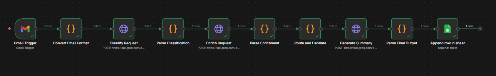
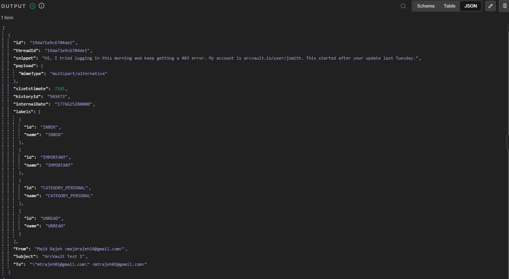
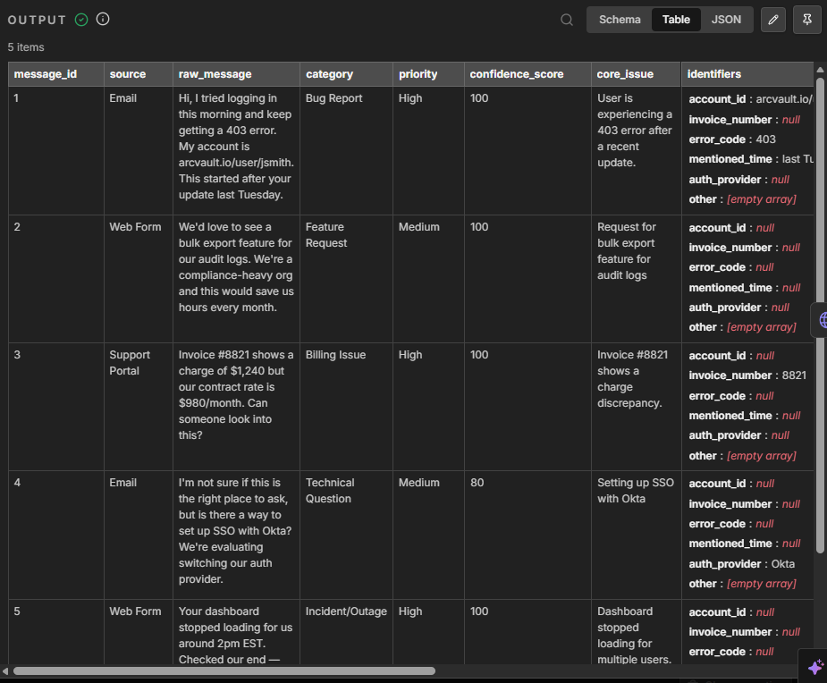

# AI Email Intake & Triage Automation

An AI-powered email intake and triage workflow built with **n8n**.

The workflow automatically processes incoming emails, classifies requests using AI, enriches the extracted information, determines the appropriate routing and escalation path, generates a structured summary, and stores the final result in Google Sheets.

## Workflow Overview



## How It Works

### 1. Email Trigger

The workflow starts when a new email is received through Gmail.



### 2. Email Processing

The incoming email is converted into a structured format and prepared for processing.


### 3. AI Classification

The request is analyzed using an AI model to determine the appropriate classification and relevant attributes.


### 4. Request Enrichment

The workflow extracts and enriches the request with additional structured information.


### 5. Routing & Escalation

Based on the classification and enriched information, the workflow determines the appropriate routing and escalation path.



### 6. Final Output

The final AI-generated result is parsed into a structured format before being stored for further processing.


## Architecture

```text
Gmail Trigger
      ↓
Convert Email Format
      ↓
Process Incoming Messages
      ↓
AI Classification
      ↓
Parse Classification
      ↓
AI Enrichment
      ↓
Parse Enrichment
      ↓
Route & Escalate
      ↓
Generate Final Output
      ↓
Parse Final Output
      ↓
Google Sheets
```

## Technologies

* **n8n** — workflow automation and orchestration
* **Gmail** — email trigger
* **AI / LLM** — classification, enrichment, and summarization
* **Google Sheets** — structured data storage
* **REST APIs** — external service integration
* **JavaScript** — data processing and transformation

## Key Features

* Automated email intake
* AI-powered request classification
* Structured data extraction
* Request enrichment
* Conditional routing
* Escalation logic
* AI-generated summaries
* Automated data storage
* End-to-end workflow orchestration

## Workflow File

The complete n8n workflow is available in:

`workflow/ai-email-intake-triage.json`

The workflow can be imported directly into an n8n instance.

## Setup

1. Import the workflow JSON into n8n.
2. Configure your Gmail credentials.
3. Configure the required AI/LLM credentials.
4. Configure your Google Sheets credentials.
5. Configure any required external API credentials.
6. Test the workflow with sample emails.
7. Activate the workflow.

## Credentials & Security

Credentials and API keys are not included in this repository.

When importing the workflow, configure your own credentials for the required services.

## Project Documentation

Additional documentation is available in the `docs/` directory.

* `architecture.pdf` — workflow architecture and design
* `prompt-documentation.pdf` — AI prompt documentation
